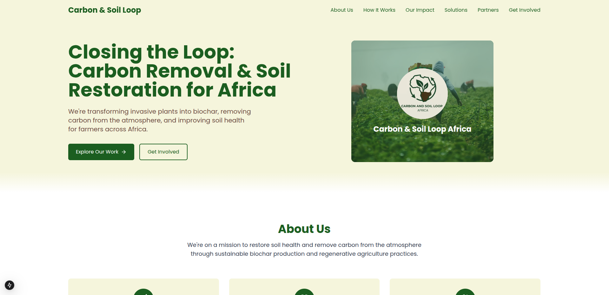
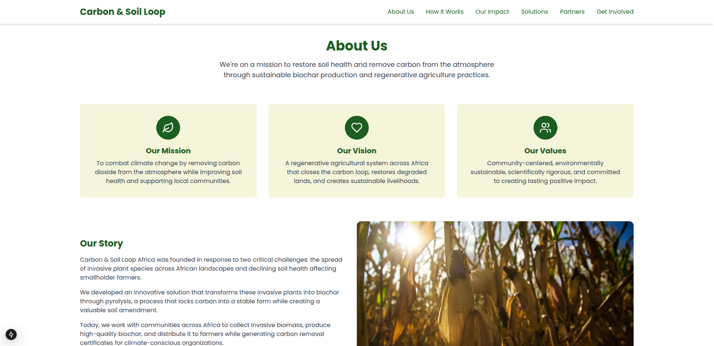

# 🌍 Carbon & Soil Loop Africa

Closing the loop: **Carbon Removal & Soil Restoration for Africa**

We are transforming invasive plants into **biochar**, removing carbon from the atmosphere, and improving soil health for farmers across Africa.

---

## 🚀 Project Overview

This platform is built to:

* Educate communities on carbon removal & soil restoration.
* Showcase our work with biochar and regenerative farming.
* Provide opportunities for partners, investors, and volunteers to get involved.

---

## 🛠 Tech Stack

* **Frontend**: [Next.js](https://nextjs.org/) + [React](https://react.dev/)
* **Styling**: [Tailwind CSS](https://tailwindcss.com/)
* **Icons**: [Lucide](https://lucide.dev/)
* **Fonts**: Local fonts with `next/font/local`
* **Deployment**: [Vercel](https://vercel.com/)

---

## 📂 Project Structure

```
carbon-soil/
├── app/               # Next.js App Router pages
├── components/        # Reusable UI components
├── public/            # Fonts, images, and static assets
├── styles/            # Global styles
└── next.config.js     # Next.js configuration
```

---

## 🔧 Getting Started

### 1. Clone the repository

```bash
git clone https://github.com/your-username/carbon-soil.git
cd carbon-soil
```

### 2. Install dependencies

```bash
npm install
# or
yarn install
```

### 3. Run the development server

```bash
npm run dev
# or
yarn dev
```

Then open [http://localhost:3000](http://localhost:3000) 🚀

---

## 📸 Screenshots

| Hero Section                                    | About Us                                          |
| ----------------------------------------------- | ------------------------------------------------- |
|  |  |

---

## 🌱 Contributing

We welcome contributions from developers, designers, and climate enthusiasts!

1. Fork the repo
2. Create your feature branch (`git checkout -b feature/new-feature`)
3. Commit your changes (`git commit -m 'Add new feature'`)
4. Push to the branch (`git push origin feature/new-feature`)
5. Open a Pull Request

---

## 🤝 Partners

We collaborate with organizations in **sustainability, climate action, and agriculture**. Interested in partnering? Reach out below.

---

## 📬 Contact

📧 Email: **[contact@carbonsoil.africa](mailto:contact@carbonsoil.africa)**
🌐 Website: [carbonsoil.africa](https://carbonsoil.africa)

---

## 📜 License

This project is licensed under the **MIT License** – feel free to use and adapt.

---

✨ *Together, we can restore African soils and remove carbon sustainably.* 🌍


